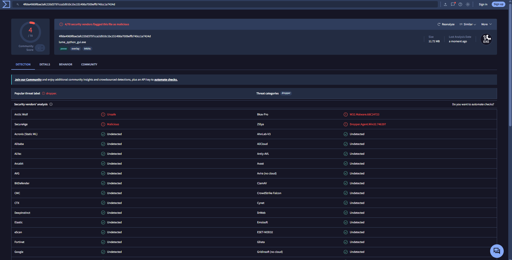
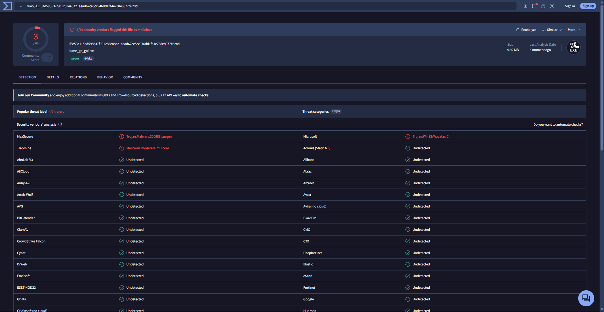
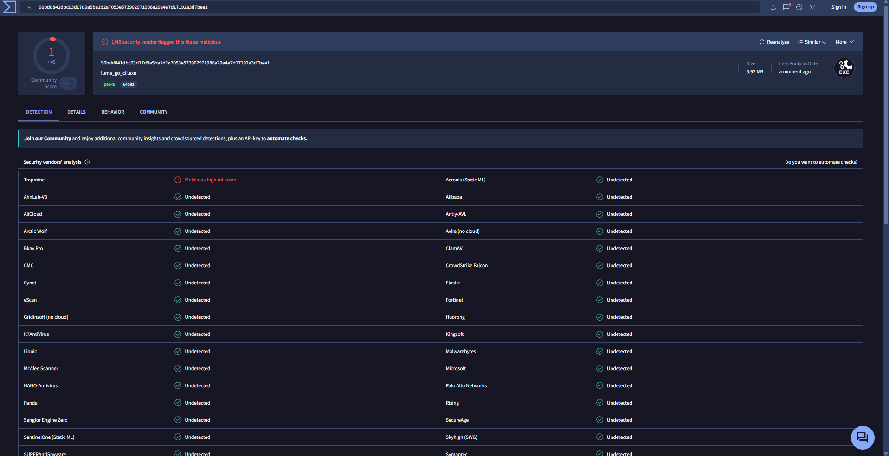

<p align="center">
    
</p>

# Lume
 

### Fotoğraf ve video arşivleme

EXIF metadata'sı ile otomatik klasörleme, MD5 (Python) ve SHA-256 (Go) ile kopya algılama.

### Photo and video archiving

Automatic folder organization with EXIF metadata, duplicate detection with MD5 (Python) and SHA-256 (Go).


## Ekran Görüntüleri

## Screenshots

**Python GUI** — koyu tema, açık tema ve Türkçe arayüz

<p align="center">
    
    
    
</p>

**Go GUI** — Türkçe ve İngilizce

<p align="center">
    
    
</p>

**Go CLI** — arşivleme, simülasyon ve yol doğrulama

<p align="center">
    
    
    
    
</p>

**Sonuç** — tarihe göre oluşan arşiv yapısı

<p align="center">
    
</p>

<details>
<summary>Diğer CLI ekran görüntüleri</summary>

<p align="center">
    
    
    
    
    
    
    
</p>

</details>

---

## Türkçe Tanıtım

Dosya Düzenleyici

Bilgisayarınızdaki dosyaları tek tek düzenlemeye artık gerek yok.
Bu araç desteklenen medya dosyalarını saniyeler içinde tarar, tek bir hedef klasör altında güvenle kopyalayıp arşivler ve işlem sonunda detaylı bir liste sunar.

### Avantajları neler?

.Yüzlerce dosyayı tek tek seçmek yerine tek tıkla hedef klasöre aktarın.
.İhtiyacınız olan desteklenen medya uzantılarını arşivleyebilirsiniz (.jpg, .png, .mp4, .mov, RAW formatları vb. — tam liste aşağıda).
.İşlem sonunda hangi dosyanın nereye kopyalanıp arşivlendiğini net bir şekilde görün.

Versiyonlar: Lume'un 3 farklı sürümü bulunmaktadır: Python GUI, Go GUI ve Go CLI.
Her sürüme ait dosyalar ve ekran görüntüleri bu repoda detaylı olarak bulunuyor.

---

## English Introduction

File Editor

No need to manually organize files on your computer one by one.
This tool scans supported media files in seconds, securely copies and archives them under a single target folder, and provides a detailed list at the end of the process.

### What are the advantages?

.Transfer hundreds of files to the target folder with a single click instead of selecting them one by one.
.Target only the supported media extensions you need (.jpg, .png, .mp4, .mov, RAW formats, etc. — full list below).
.Clearly see which file was copied and archived where at the end of the process.

Versions: Lume has 3 different versions: Python GUI, Go GUI, and Go CLI.
Files and screenshots for each version are available in detail in this repository.

---

### Proje Teknolojileri

### Project Technologies

<p align="left">
  <a href="https://www.python.org" target="_blank" rel="noreferrer">
    
  </a>
  <a href="https://go.dev" target="_blank" rel="noreferrer">
    
  </a>
  <a href="https://github.com/" target="_blank" rel="noreferrer">
    
  </a>
  <a href="https://github.com/features/copilot" target="_blank" rel="noreferrer">
    
  </a>
  <a href="https://code.visualstudio.com/" target="_blank" rel="noreferrer">
    
  </a>
</p>

---

## Gizlilik & Güvenlik

.Tüm işlemler yerel makinenizde çalışır.
.İnternet bağlantısı gerekmez.
.Veri toplama veya analiz yoktur.
.Dosyalar bilgisayarınızda tutulur.
.Açık kaynak bir projedir.
.Kişisel veri saklanmaz veya gönderilmez.

## Veri Depolama

- `lume_config.json` - GUI sürümlerinde yerel ayarlar 

- `lume_app.log` - GUI sürümlerinde yerel işlem loglanması

---

## Privacy & Security

.All operations run locally on your machine.
.No internet connection is required or used.
.No data collection or analytics.
.Files stay on your computer.
.Open source project.
.No personal data is stored or transmitted.

## Data Storage

- `lume_config.json` - Local settings for GUI versions 
  
- `lume_app.log` - Local operation log for GUI versions

---

## VirusTotal Doğrulamaları

Lume'un Python GUI, Go GUI ve Go CLI sürümleri için yayınlanan `.exe` dosyalarını VirusTotal üzerinde ayrıca kontrol edebilirsiniz.
Tarama ekran görüntülerini burada tek yerde paylaşıyorum.

VirusTotal tek başına kesin güvenlik garantisi değildir, ama indirilen dosyayı farklı antivirüs motorlarıyla hızlıca karşılaştırmak için iyi bir referanstır.
Lume yerel çalışır; internet bağlantısı, telemetri veya analiz gönderimi kullanmaz.

> **Not:** Aşağıdaki tarama görselleri **v1.1** sürümünün dosyalarına aittir; güncel sürümün taraması değildir.
> İndirdiğiniz dosyayı kendiniz doğrulamak için aşağıdaki SHA-256 özetlerini kullanın.

### v2.2 dosya özetleri (SHA-256)

| Dosya | SHA-256 |
|---|---|
| `lume_python_gui.exe` | `3ffe945baa0bdb70d400db4af980c267783e656604459445e377a2e7979ec393` |
| `lume_go_gui.exe` | `da44d19a4f03f8b2d62087614f2dc259e3c810ee1714926d76d136f425b09115` |
| `lume_go_cli.exe` | `ecf701023a2e881e8a0af3e9414eba75e71e603f952e15ce7203bc20dbcb218b` |

İndirdiğiniz dosyanın özetini PowerShell ile alın ve yukarıdakiyle karşılaştırın:

```powershell
Get-FileHash .\lume_go_gui.exe -Algorithm SHA256
```

Aynı özeti VirusTotal'ın arama kutusuna yapıştırarak, dosyayı yüklemeden güncel tarama sonucuna bakabilirsiniz.

## VirusTotal Verification

You can also check the released `.exe` files for the Python GUI, Go GUI, and Go CLI versions on VirusTotal.
I keep the scan screenshots here in one place.

VirusTotal is not a complete security guarantee by itself, but it is a useful reference for comparing a downloaded file against multiple antivirus engines.
Lume runs locally and does not require internet access, telemetry, or analytics.

> **Note:** The scan screenshots below are from the **v1.1** binaries and do not reflect the current release.
> To verify what you downloaded, use the SHA-256 digests above (`v2.2 dosya özetleri`) and compare them with:
>
> ```powershell
> Get-FileHash .\lume_go_gui.exe -Algorithm SHA256
> ```
>
> Pasting that digest into VirusTotal's search box shows the current scan without uploading the file.

### Python GUI

.Dosya / File: `lume_python_gui.exe`
.VirusTotal görseli / Screenshot: [Python GUI VirusTotal scan](screenshots/virustotal/python-gui-virustotal.png)

<p align="center">
  
</p>

### Go GUI

.Dosya / File: `lume_go_gui.exe`
.VirusTotal görseli / Screenshot: [Go GUI VirusTotal scan](screenshots/virustotal/go-gui-virustotal.png)

<p align="center">
  
</p>

### Go CLI

.Dosya / File: `lume_go_cli.exe`
.VirusTotal görseli / Screenshot: [Go CLI VirusTotal scan](screenshots/virustotal/go-cli-virustotal.png)

<p align="center">
  
</p>

---

## Lume CLI

.Lume CLI versiyonunu kullanmak için GitHub'daki dosyaları indirin ve aşağıdaki adımları izleyin.

.Türkçe Kullanım

Adım 1: PowerShell'i Açın
- `Windows + R` tuşlarına basın.
- `powershell` yazıp Enter tuşuna basın.

Adım 2: EXE'nin Olduğu Klasöre Gidin
```powershell
cd "C:\DosyaYolu\lume-app\cli version lume"
```

Not:
`"C:\DosyaYolu..."` kısmını indirdiğiniz proje klasörünün kendi bilgisayarınızdaki gerçek yolu ile değiştirin.

Adım 3: Programı Çalıştırın

Varsayılan olarak doğrudan dosya sistemi değiştirme tarihini (ModTime) kullanarak arşivlemek için:
```powershell
.\lume_go_cli.exe "C:\KaynakKlasor" "C:\HedefKlasor"
```

Seçenekler ve Parametreler:
* `--exif`       : Görsellerde ve RAW dosyalarında EXIF çekim tarihini (DateTimeOriginal) okur.
* `--rename`     : Dosyaları hedef dizine kopyalarken `YYYYMMDD_HHMMSS` formatında yeniden adlandırır.
* `--dry-run`    : Simülasyon modunda çalışır. Diske hiçbir klasör oluşturulmaz veya kopyalama yapılmaz.
* `--help`, `-h` : Yardım menüsünü ve parametre listesini görüntüler.

Örnek (EXIF ve Yeniden Adlandırma ile Kopyalama):
```powershell
.\lume_go_cli.exe "C:\KaynakKlasor" "C:\HedefKlasor" --exif --rename
```

---

.To use the Lume CLI version, download the files from GitHub and follow the steps below:

.English Usage
  
Step 1: Open PowerShell
.Press `Windows + R`.
.Type `powershell` and press Enter.

Step 2: Navigate to EXE Folder
```powershell
cd "C:\PathToProject\lume-app\cli version lume"
```

Note:
Replace `"C:\PathToProject..."` with the actual path of the project folder on your computer.

Step 3: Run the Program

By default, to archive files using their file system modification date (ModTime):
```powershell
.\lume_go_cli.exe "C:\SourceFolder" "C:\TargetFolder"
```

Options and Parameters:
* `--exif`       : Reads EXIF shooting date (DateTimeOriginal) from images and RAW files.
* `--rename`     : Renames files to `YYYYMMDD_HHMMSS` format when copying to target.
* `--dry-run`    : Runs in simulation mode. No folders are created on disk.
* `--help`, `-h` : Shows the bilingual help menu.

Example (with EXIF and renaming):
```powershell
.\lume_go_cli.exe "C:\SourceFolder" "C:\TargetFolder" --exif --rename
```

---

## Desteklenen formatlar

Üç sürüm de aynı listeyi destekler:

* Görsel: `.jpg` `.jpeg` `.png` `.webp` `.heic` `.tiff` `.gif` `.bmp`
* RAW: `.dng` `.cr2` `.nef` `.arw` `.orf`
* Video: `.mp4` `.mov` `.avi` `.mkv` `.m4v` `.flv` `.wmv` `.mpg` `.mpeg` `.3gp`

EXIF çekim tarihi yalnız görsel ve RAW dosyalarında okunur; videolarda dosya tarihi kullanılır. Python GUI sürümü EXIF'i yalnız JPEG ve TIFF dosyalarından okur, diğerlerinde dosya tarihine düşer.

Her üç sürüm de dosyaları **kopyalar** — kaynak klasördeki dosyalar silinmez veya taşınmaz. Kopyalama sonrası hedef dosyanın karması kaynakla karşılaştırılır; uyuşmazsa bozuk kopya silinir ve kaynak korunur.

## Supported formats

All three versions support the same list:

* Images: `.jpg` `.jpeg` `.png` `.webp` `.heic` `.tiff` `.gif` `.bmp`
* RAW: `.dng` `.cr2` `.nef` `.arw` `.orf`
* Video: `.mp4` `.mov` `.avi` `.mkv` `.m4v` `.flv` `.wmv` `.mpg` `.mpeg` `.3gp`

EXIF capture dates are read from images and RAW files only; videos fall back to the file date. The Python GUI reads EXIF from JPEG and TIFF only and falls back to the file date for everything else.

All three versions **copy** files — nothing is moved or deleted from the source folder. After each copy the target hash is compared against the source; on mismatch the corrupt copy is removed and the source is left untouched.

---

Serbest

.Uygulamanın genel amacı desteklenen formatlardaki dosyaları bilgisayarınızda düzgün bir şekilde kopyalayıp arşivlemektir.
.Uygulamanın tüm versiyonlarını güvenlik taramalarından geçirdim ve tespit ettiğim potansiyel riskleri düzeltip kod güvenliğini artırdım.
.Düzeltilen kısımlar ve arkasındaki mantık hakkında yakında bir blog yazısı da paylaşacağım.
.Uygulamayla ilgili her türlü geri bildirim ve soru için "artabqos251@gmail.com" adresinden bana ulaşabilirsiniz.

Misc

.The main purpose of the application is to neatly copy and archive files in supported formats on your computer.
.I have conducted comprehensive security scans on all versions of the application, resolving potential risks and improving code safety.
.I will also publish a blog post detailing these fixes and the engineering decisions behind them.
.For any inquiries or feedback, feel free to contact me at "artabqos251@gmail.com".

---

Bilinen Sorunlar

.Koyu Mod Tablo Görünümü (Go GUI):
.Go GUI sürümündeki koyu mod butonuna basıldığında tablonun (TableView) ve bazı butonların tamamen koyulaşmaması (beyaz kalması) sorunu bilinmektedir.
.Bu durum Windows işletim sisteminin yerel Win32 listview temalarından kaynaklanmaktadır.
.Bu sorun ileriki sürümlerde ele alınacaktır.

Known Issues

.Dark Mode Table View (Go GUI):
.There is a known issue in the Go GUI version where the TableView and certain buttons fail to completely darken (remaining white) when Dark Mode is enabled.
.This is related to the native Win32 listview theme engine in Windows and will be addressed in future releases.
